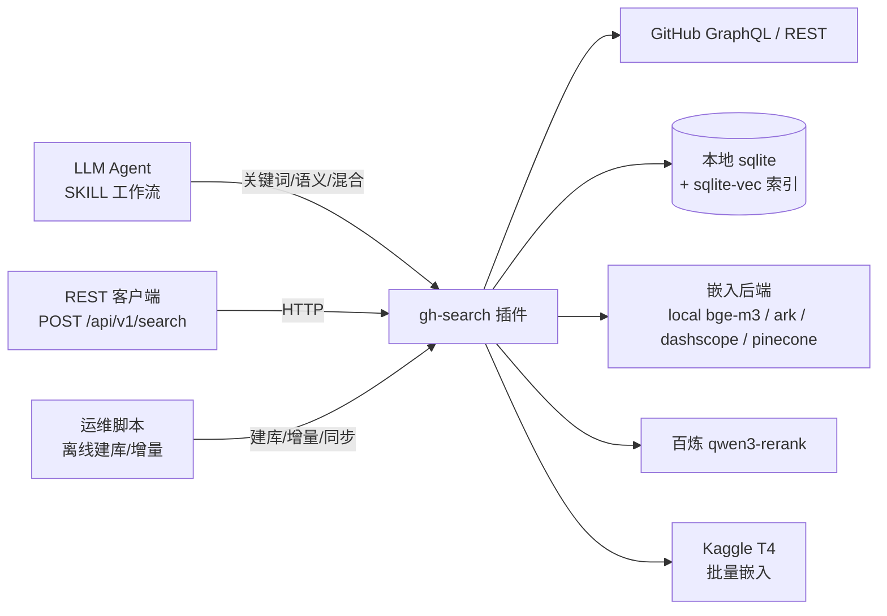
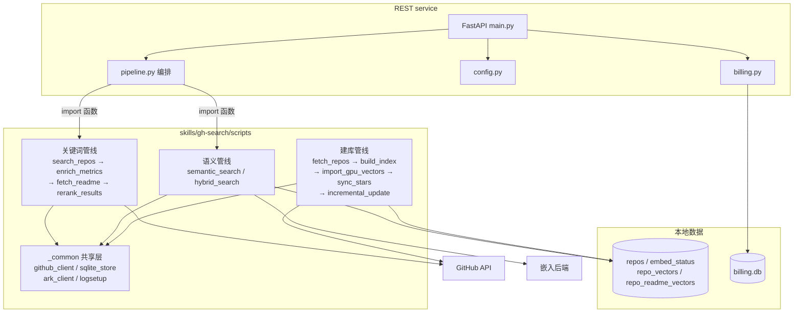

# gh-search 架构

> 更新于 2026-09-01。本文描述当前生产实现的三层结构：**关键词在线管线**、**语义索引管线**、**REST service**。
> 历史方案与踩坑细节见 `embedding-engineering-notes.md`；测试与评测结论见 `testing-evaluation.md`。
> 若文档与脚本不一致，以脚本 `--help` 与源码为准。

## 系统上下文（C4 Level 1）



三个外部角色：LLM Agent（驱动 SKILL 脚本）、REST 客户端（驱动 service）、运维脚本（离线建库）。插件统一依赖 GitHub API、本地 sqlite-vec 索引，以及多个嵌入/重排后端。

## 容器图（C4 Level 2）



三个可运行单元：
- **Skills 脚本**（CLI，被 Agent 或 service 调用）：关键词管线、语义管线、建库管线，共享 `_common` 层。
- **REST service**（FastAPI）：`pipeline.py` 通过 `import` 直接调用 skills 脚本的函数，不经过子进程。
- **本地数据**：主索引库（repos + 两个 vec0 向量表）与计费库。

---

## 一、关键词在线管线（无索引）

确定性 CLI 管线，通过 JSON 文件/内存传递候选，全程在线打 GitHub，不读本地索引。LLM 只负责意图→关键词转写与最终排序，脚本本身不做 LLM 调用。

```
search_repos.py (Step1+2)  →  enrich_metrics.py (Step3)  →  fetch_readme.py (Step4)  →  rerank_results.py (Step4.5)
   召回 200-400                成熟度过滤 20-60              README 片段 20-60             精排 top_k
```

| 脚本 | 角色 | 关键参数 |
|------|------|----------|
| `search/search_repos.py` | Step1 GraphQL 召回 + Step2 硬过滤 | `--query`/`--group`、`--language`、`--min-stars`(200)、`--max-recalls`(400)、`--stale-days`(180) |
| `search/enrich_metrics.py` | Step3 成熟度指标（30天 commit + 合并 PR）单次批量 GraphQL | `--input`、`--min-commits-30d`(3) |
| `search/fetch_readme.py` | Step4 深度模式 README 片段（head+tail 截断） | `--input`、`--max-chars`(2000)、`--head`(1200)、`--tail`(300) |
| `search/rerank_results.py` | Step4.5 百炼 qwen3-rerank 精排（缺 key 优雅降级） | `--input`、`--query`、`--top-n`(50) |

关键设计：
- Step1 用 `fork:false` 而非 `not:fork`（GraphQL 陷阱，后者静默返回 0）。
- 关键词 ≤5 词分块（GitHub 布尔算子上限），AND 优先、召回 <20 时 OR 兜底补池。
- description 为空**不丢弃**（很多正经项目不填描述，语义匹配交给 LLM）。
- Step3 活跃度双条件满足其一即保留（30 天 commit ≥3 或 180 天内推送），避免误杀稳定低变更项目。
- 独立贡献者数已移除（REST /contributors 是主要耗时来源，防玩具项目作用由 star 阈值 + 活跃度替代）。

---

## 二、语义索引管线（离线建库 + 在线查询）

### 建库

```
fetch_repos.py ──▶ repos 表（metadata + stars 快照）
fetch_readmes.py / fetch_readmes_server.py ──▶ repos.readme_embed_text（stars≥2000）
build_index.py ──▶ repo_vectors + embed_status（本地/pinecone/ark 后端）
import_gpu_vectors.py ──▶ repo_vectors（Kaggle npz 回导）
repo_readme_vectors ──▶ Kaggle T4 批量嵌入（README 双通道）
sync_stars.py ──▶ repos.stars（排序先验快照刷新）
incremental_update.py ──▶ 增量插新/变化检测重嵌
```

| 脚本 | 角色 | 关键参数 |
|------|------|----------|
| `data/fetch_repos.py` | 全量元数据抓取（预分片 ≤1000/region，断点续传） | `--stars-min`(100)、`--resume`、`--workers`(4)、`--update` |
| `data/fetch_readmes.py` | README 抓取清洗（本地，走 `gh` CLI） | `--min-stars`(2000)、`--max-chars`(1000) |
| `data/fetch_readmes_server.py` | README 抓取（服务器端纯 stdlib，硬编码 `/root/` 路径） | 无 CLI 参数 |
| `pipeline/build_index.py` | 批量嵌入（断点续传，多账号轮换） | `--backend`(pinecone/ark/local)、`--shard i:n`、`--force-ids-file` |
| `pipeline/import_gpu_vectors.py` | Kaggle npz 回导（校验维度/归一化/id 完整性） | 位置参数 `npz_path` |
| `maintenance/sync_stars.py` | star 快照刷新（REST 自适应区间，30 req/min） | `--min-stars`(2000) |
| `maintenance/incremental_update.py` | week 只插新 / month 变化检测重嵌 | `--mode`(week/month)、`--since`(7) |

### 查询

| 脚本 | 角色 | 关键参数 |
|------|------|----------|
| `search/semantic_search.py` | 语义通道：嵌入 → kNN → README 双通道合并 → star 先验混合排序 | `--top-k`(50)、`--star-weight`(0.03)、`--backend`(local)、`--dual-query`、`--pure-semantic` |
| `search/hybrid_search.py` | 并行通道：关键词 + 语义 union 去重 | `--top-k`(50)、`--backend`(local) |

语义查询流程（`semantic_search.py`）：
1. 嵌入 query（`local`=bge-m3 fp32，`dashscope`=qwen3.7，`ark`=doubao，`pinecone`=llama）。
2. 深窗口 kNN（star_weight>0 时 k=4000，vec0 全库暴力扫描零额外成本）。
3. README 双通道合并：与 `repo_readme_vectors` 的 kNN 按 id 取最小距离（同模型同空间，表非空自动启用）。
4. fork/archived 硬过滤 + `min_stars` 过滤（用本地 stars 快照）。
5. 混合排序：`score = distance − star_weight·log10(1+stars快照)`（λ=0.03）。
6. 截断 top_k，仅对最终 top_k 在线刷新实时 stars（失败回落快照）。

---

## 三、REST service

FastAPI 封装同一批 scripts，通过 `import` 直接调用函数（非子进程）。无 LLM 环节，只跑确定性脚本。

| 端点 | 方法 | 说明 |
|------|------|------|
| `/api/v1/health` | GET | DB 连通性与 repo/vector 计数 |
| `/api/v1/search` | POST | 按 channel 执行管线（keyword/semantic/hybrid），可选 enrich/readme/rerank |
| `/api/v1/billing/summary` | GET | 按 `user_id` + `period`(YYYY-MM) 汇总用量 |

| 文件 | 角色 |
|------|------|
| `service/main.py` | FastAPI 入口 + 3 端点 + 记费钩子 |
| `service/pipeline.py` | `run_pipeline()` 编排：召回 → enrich → readme → rerank |
| `service/config.py` | config.yaml 加载 + 环境变量覆盖 |
| `service/billing.py` | SQLite 计费账本（调用次数/候选数/耗时，token 字段预留未填充） |
| `service/models.py` | Pydantic 请求/响应模型 |

**SearchRequest** 字段：`query`、`channel`(keyword/semantic/hybrid)、`language`、`min_stars`(200)、`top_k`(50)、`star_weight`(0.03)、`enrich`、`readme`、`rerank`。

配置（`config.yaml`，示例见 `config.yaml.example`）：
- `github.token` / `timeout`
- `embedding.backend` / `db_path`
- `server.host` / `port`（建议值，实际由 uvicorn 外部启动）
- `billing.db_path`

环境变量覆盖：`GH_TOKEN`/`GITHUB_TOKEN`、`GH_SEARCH_TIMEOUT`、`GH_SEARCH_BACKEND`、`GH_SEARCH_DB`、`GH_SEARCH_EMBED_DIM`。

与 SKILL 工作流的关键差异：
- service 的 `keyword` 通道把原始 query 直接传给 `step1_recall`（单组），不做 3~5 组意图转写。
- service 无 Step2 语义初筛（subagent），只跑硬过滤。
- `_rerank` 因脚本要求文件输入，通过临时 JSON 文件 round-trip。

---

## 四、`_common` 共享层

| 模块 | 角色 |
|------|------|
| `_common/github_client.py` | `GitHubClient` 封装 `gh` CLI（GraphQL + REST），瞬时网络错误重试 3 次，读 `GH_TOKEN`/`GITHUB_TOKEN` 否则用 `gh` 凭据 |
| `_common/sqlite_store.py` | schema + sqlite-vec 封装。EMBED_DIM 由 `GH_SEARCH_EMBED_DIM` 控制（默认 1024） |
| `_common/ark_client.py` | `ArkChat`（查询改写/翻译）+ `ArkEmbed`（doubao 嵌入，429 退避，强制 IPv4） |
| `_common/logsetup.py` | 共享轮转日志（5MB×3）到 `skills/data/<logger>.log` |

---

## 五、数据库 schema

默认库：`plugins/gh-search/data/gh_search_index_v3.db`（`GH_SEARCH_DB` 可覆盖）。

| 表 | 用途 |
|----|------|
| `repos` | 元数据：`id`、`name`、`description`、`topics`(JSON)、`primary_language`、`is_fork`、`is_archived`、`embed_text`、`stars`(迁移新增)、`readme_embed_text`(迁移新增) |
| `embed_status` | 嵌入状态：`id`、`model`、`token_count`、`embed_text_hash`(md5 16位)、`embedded_at` |
| `repo_vectors` | vec0 向量表（元数据嵌入通道），`embedding FLOAT[1024]` |
| `repo_readme_vectors` | vec0 向量表（README 双通道），`embedding FLOAT[1024]` |

向量维度：1024（bge-m3 fp32 / llama-text-embed-v2），2048（doubao v2 旧库）。kNN 返回余弦距离（`L2²/2`）。

---

## 六、运维命令速查

```bash
# 语义查询（生产姿势）
GH_SEARCH_BACKEND=local GH_SEARCH_DB=<v3库> \
  python3 scripts/search/semantic_search.py --query "..." --top-k 15

# 并行查询（关键词 + 语义 union）
python3 scripts/search/hybrid_search.py --query "..." --top-k 15 --backend local

# 关键词召回（单组）
python3 scripts/search/search_repos.py --query "..." --language python --json

# star 快照刷新（每周一次，覆盖 ≥2000★，约 40 分钟受 GitHub 限速）
python3 scripts/maintenance/sync_stars.py --db <v3库>

# 增量补嵌新仓库（断点续传，自动跳过已有）
python3 scripts/pipeline/build_index.py --backend local --db <v3库>

# Rerank 精排（需 DASHSCOPE_API_KEY / DASHSCOPE_RERANK_URL）
python3 scripts/search/rerank_results.py --input step3.json --query "..." --json

# REST service（外部启动）
uvicorn service.main:app --host 0.0.0.0 --port 8000
```

---

## 已知限制与后续方向

1. README 双通道覆盖有限（约 30,378 / 432,586 ≈ 7%，仅 stars≥2000 已抓到 README 的仓库）；属性型查询对未覆盖仓库仍依赖描述质量。
2. 查询端本地模型加载有 ~5s 冷启动（fp32 ONNX），高频使用可加常驻进程。
3. OpenList 在 bge-m3 下裸距离跌出前 4000，靠 star 先验兜底。
4. billing 的 `embedding_tokens`/`rerank_tokens` 当前未填充，`total_tokens` 恒为 0，是调用计数账本而非 token 计费表。
